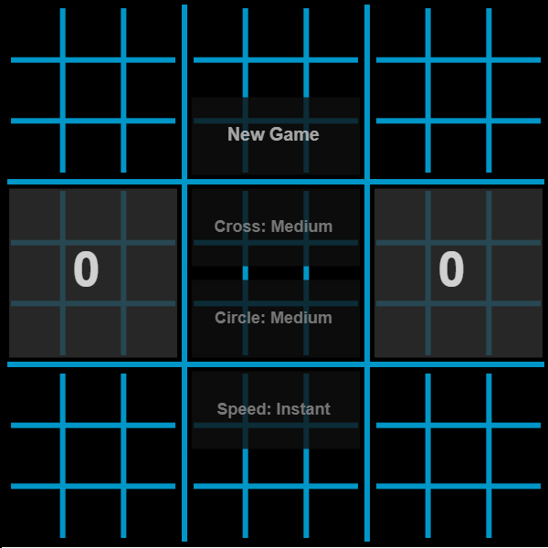

# UltimateTicTacToeJS

Ultimate Tic-tac-toe is a variant on the famous tic-tac-toe game. Creating one line of three symbols is not enough now! This is a  game that is simple to play yet difficult to master. Try to beat the AI and enjoy the awesome animation effects. **Click the image to play the game.**

## Rules of the game

Each small 3-by-3 tic-tac-toe board is referred to as a local board, and the larger 3-by-3 board is referred to as the global board. The game starts with X playing wherever they want in any of the 81 empty spots. This move 'sends' their opponent to its relative location. For example, if X played in the top right square of their local board, then O needs to play next in the local board at the top right of the global board. O can then play in any one of the nine available spots in that local board, each move sending X to a different local board. If a move is played so that it is to win a local board by the rules of normal tic-tac-toe, then the entire local board is marked as a victory for the player in the global board. Once a local board is won by a player or it is filled completely, no more moves may be played in that board. If a player is sent to such a board, then that player may play in any other board. Game play ends when either a player wins the global board or there are no legal moves remaining, in which case the game is a draw.

## Software Components

The serverless, fully front-end based application is a port of my C# UltimateTicTacToe implementation [2], but with added visuals. All the code is written in JavaScript (with some basic *html* and *css*) and the visualization is done using the *p5.js* library [3]. The frame, crosses and circles are animated; rotation, fading, scaling and a nice jumping effect of the final winning line.

The computationally expensive algorithms are run using Web Workers [4], to ensure optimal responsiveness of the GUI. Web Workers are a simple means for web content to run scripts in background threads. 

The application supportes 5 types of players; the `Human` player allows the user to click one of the valid squares to play a move, while the `Easy`, `Medium`, `Hard` and `Godlike` players are the different difficulties of the AI player. Each difficulty uses a Monte Carlo Tree Search algorithm described in [5] and the difference between them is the computational time given to them. Since this algorithm relies on random simulations of games in order to determine how good a position is instead of a positional evaluation, it is able to accurately assess how good a current position is, given enough simulations. This means that more simulation time available will result in a better performance. Computer implementations using Monte Carlo Tree Search tend to outperform MiniMax solutions [6], and can consistently beat human opponents. Good luck trying to beat the `Godlike` player!

## Sources

1. https://en.wikipedia.org/wiki/Ultimate_tic-tac-toe
2. https://github.com/colinschepers/UltimateTicTacToe-CSharp
3. https://p5js.org/
4. https://www.w3schools.com/html/html5_webworkers.asp
5. https://en.wikipedia.org/wiki/Monte_Carlo_tree_search
6. https://en.wikipedia.org/wiki/Minimax
